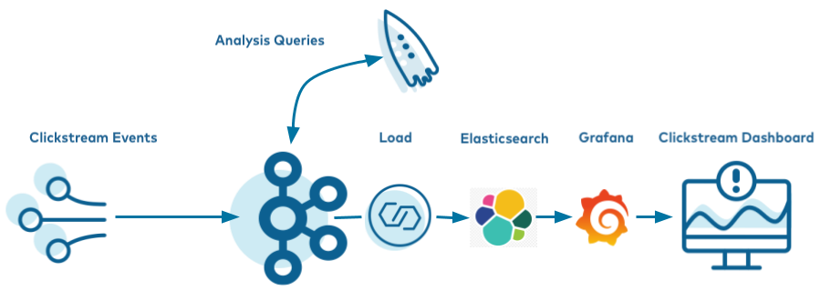
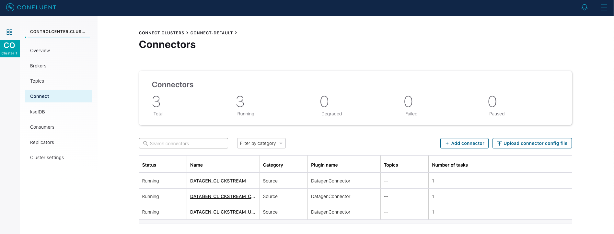
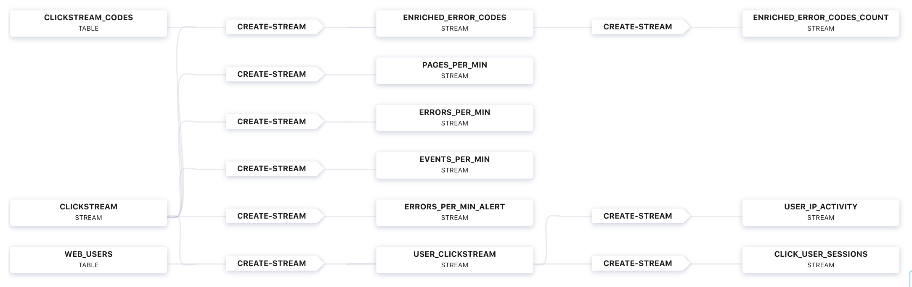
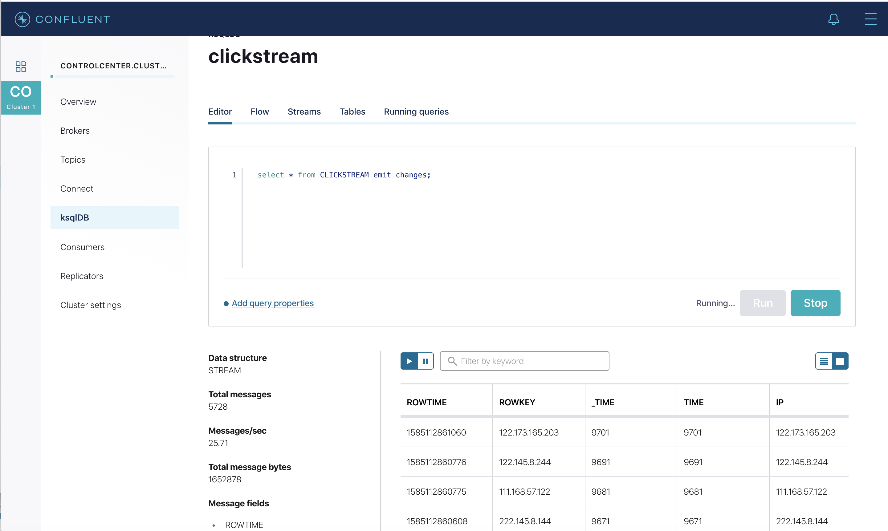
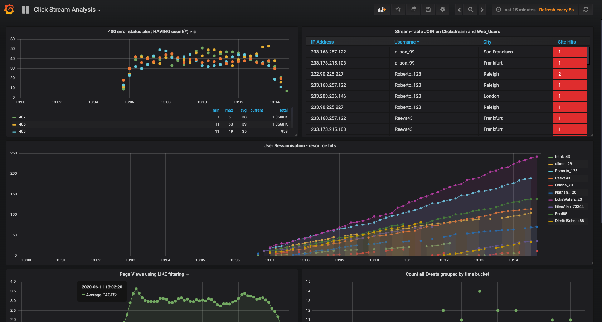
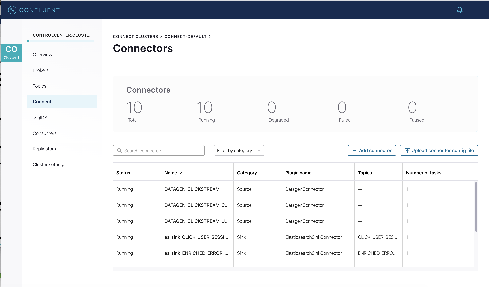

# Clickstream Demo with Confluent Platform, ksqlDB, and Elasticsearch

## [Screenshots from execution are emdedded in this README (stored in `screenshots` folder)](screenshots/)



# Overview

This README provides step-by-step instructions for running the Clickstream Data Pipeline using Confluent Platform, ksqlDB, Kafka Connect, Elasticsearch, and Grafana. It is adapted from the official Confluent tutorial, excluding download/setup steps that are pre-configured in this repository.

This example shows how KSQL can be used to process a stream of click data, aggregate and filter it, and join to information about the users.
Visualisation of the results is provided by Grafana, on top of data streamed to Elasticsearch. 

# Documentation

You can find the documentation for running this example and its accompanying tutorial at [https://docs.confluent.io/platform/current/tutorials/examples/clickstream/docs/index.html](https://docs.confluent.io/platform/current/tutorials/examples/clickstream/docs/index.html?utm_source=github&utm_medium=demo&utm_campaign=ch.examples_type.community_content.clickstream)

## Start Up

Clone the git project.

For Linux or macOS users:

1. Open your terminal and navigate to the desired directory and clone the project:

```bash
git clone https://github.com/lukaszkn/m10_kafkabasics_sql_local.git
```

2. Move to the project folder:

```bash
cd m10_kafkabasics_sql_local/
```

</details>


Ensure that Docker have full access for the project files, run in the git root direcotry:

```bash
mkdir -p confluent-hub-components/ && chmod -R 777 confluent-hub-components/
```

Download the connectors:

```bash
docker run --rm -v $PWD/confluent-hub-components:/usr/share/confluent-hub-components confluentinc/cp-kafka-connect:7.9.0 bash -c 'confluent-hub install --no-prompt confluentinc/kafka-connect-elasticsearch:10.0.2'
```

```bash
docker run --rm -v $PWD/confluent-hub-components:/usr/share/confluent-hub-components confluentinc/cp-kafka-connect:7.9.0 bash -c 'confluent-hub install --no-prompt confluentinc/kafka-connect-datagen:0.4.0'
```

Provide full access for Docker to the newest downloaded files:

```bash
chmod -R 777 confluent-hub-components/
```

Launch the tutorial in Docker.

```bash
docker-compose up -d
```


After a minute or so, run the docker-compose ps status command to ensure that everything has started correctly:

```bash
docker-compose ps -a
```

Your output should resemble:

```
NAME              IMAGE                                                 COMMAND                    SERVICE           CREATED          STATUS          PORTS
connect           cnfldemos/cp-server-connect-datagen:0.6.4-7.6.0       "/etc/confluent/dock…"     connect           14 seconds ago   Up 11 seconds   0.0.0.0:8083->8083/tcp, :::8083->8083/tcp, 9092/tcp
control-center    confluentinc/cp-enterprise-control-center:7.9.0       "/etc/confluent/dock…"     control-center    14 seconds ago   Up 10 seconds   0.0.0.0:9021->9021/tcp, :::9021->9021/tcp
elasticsearch     docker.elastic.co/elasticsearch/elasticsearch:6.3.0   "/usr/local/bin/dock…"     elasticsearch     14 seconds ago   Up 12 seconds   0.0.0.0:9200->9200/tcp, :::9200->9200/tcp, 9300/tcp
grafana           grafana/grafana:5.2.4                                 "/run.sh"                  grafana           14 seconds ago   Up 12 seconds   0.0.0.0:3000->3000/tcp, :::3000->3000/tcp
kafka             confluentinc/cp-server:7.9.0                          "/etc/confluent/dock…"     kafka             14 seconds ago   Up 12 seconds   9092/tcp
ksqldb-cli        confluentinc/cp-ksqldb-cli:7.9.0                      "/bin/sh"                  ksqldb-cli        14 seconds ago   Up 10 seconds
ksqldb-server     confluentinc/cp-ksqldb-server:7.9.0                   "bash -c '\n  echo \"W…"   ksqldb-server     14 seconds ago   Up 11 seconds   0.0.0.0:8088->8088/tcp, :::8088->8088/tcp
schema-registry   confluentinc/cp-schema-registry:7.9.0                 "/etc/confluent/dock…"     schema-registry   14 seconds ago   Up 11 seconds   8081/tcp
tools             cnfltraining/training-tools:5.4                       "/bin/bash"                tools             14 seconds ago   Up 12 seconds
zookeeper         confluentinc/cp-zookeeper:7.9.0                       "/etc/confluent/dock…"     zookeeper         14 seconds ago   Up 12 seconds   2181/tcp, 2888/tcp, 3888/tcp
```


please ensure that the `STATUS` is `UP`. Wait 2-3 min, then proceed with the next steps.

# Create the Clickstream Data

1. Launch the ksqlDB CLI:

```bash
docker-compose exec ksqldb-cli ksql http://ksqldb-server:8088
```

2. Ensure the ksqlDB server is ready to receive requests by running the following until it succeeds:

```bash
show topics;
```

The output should look similar to:

```
 Kafka Topic                     | Partitions | Partition Replicas
-------------------------------------------------------------------
 docker-connect-configs          | 1          | 1
 docker-connect-offsets          | 25         | 1
 docker-connect-status           | 5          | 1
 ksql-clusterksql_processing_log | 1          | 1
-------------------------------------------------------------------
```


3. Run the script `create-connectors.sql` that executes the ksqlDB statements to create three source connectors for generating mock data.

```bash
RUN SCRIPT '/scripts/create-connectors.sql';
```

The output should look similar to:

```
CREATE SOURCE CONNECTOR datagen_clickstream_codes WITH (
  'connector.class'          = 'io.confluent.kafka.connect.datagen.DatagenConnector',
  'kafka.topic'              = 'clickstream_codes',
  'quickstart'               = 'clickstream_codes',
  'maxInterval'              = '20',
  'iterations'               = '100',
  'format'                   = 'json',
  'key.converter'            = 'org.apache.kafka.connect.converters.IntegerConverter');
 Message
---------------------------------------------
 Created connector DATAGEN_CLICKSTREAM_CODES
---------------------------------------------
[...]
```


4. Now the `clickstream` generator is running, simulating the stream of clicks. Sample the messages in the clickstream topic:

```bash
print clickstream limit 3;
```

Your output should resemble:

```
 Key format: HOPPING(JSON) or TUMBLING(JSON) or HOPPING(KAFKA_STRING) or TUMBLING(KAFKA_STRING) or KAFKA_STRING
 Value format: JSON or KAFKA_STRING
 rowtime: 2020/06/11 10:38:42.449 Z, key: 222.90.225.227, value: {"ip":"222.90.225.227","userid":12,"remote_user":"-","time":"1","_time":1,"request":"GET /images/logo-small.png HTTP/1.1","status":"302","bytes":"1289","referrer":"-","agent":"Mozilla/5.0 (Windows NT 10.0; Win64; x64) AppleWebKit/537.36 (KHTML, like Gecko) Chrome/59.0.3071.115 Safari/537.36"}
 rowtime: 2020/06/11 10:38:42.528 Z, key: 111.245.174.248, value: {"ip":"111.245.174.248","userid":30,"remote_user":"-","time":"11","_time":11,"request":"GET /site/login.html HTTP/1.1","status":"302","bytes":"14096","referrer":"-","agent":"Mozilla/5.0 (Windows NT 10.0; Win64; x64) AppleWebKit/537.36 (KHTML, like Gecko) Chrome/59.0.3071.115 Safari/537.36"}
 rowtime: 2020/06/11 10:38:42.705 Z, key: 122.152.45.245, value: {"ip":"122.152.45.245","userid":11,"remote_user":"-","time":"21","_time":21,"request":"GET /images/logo-small.png HTTP/1.1","status":"407","bytes":"4196","referrer":"-","agent":"Mozilla/5.0 (Windows NT 10.0; Win64; x64) AppleWebKit/537.36 (KHTML, like Gecko) Chrome/59.0.3071.115 Safari/537.36"}
 Topic printing ceased
```


5. The second data generator running is for the HTTP status codes. Sample the messages in the `clickstream_codes` topic:

```bash
print clickstream_codes limit 3;
```

Your output should resemble:

```
 Key format: KAFKA_INT
 Value format: JSON or KAFKA_STRING
 rowtime: 2020/06/11 10:38:40.222 Z, key: 200, value: {"code":200,"definition":"Successful"}
 rowtime: 2020/06/11 10:38:40.688 Z, key: 404, value: {"code":404,"definition":"Page not found"}
 rowtime: 2020/06/11 10:38:41.006 Z, key: 200, value: {"code":200,"definition":"Successful"}
 Topic printing ceased
```


6. The third data generator is for the user information. Sample the messages in the `clickstream_users` topic:

```bash
print clickstream_users limit 3;
```

Your output should resemble:

```
 Key format: KAFKA_INT
 Value format: JSON or KAFKA_STRING
 rowtime: 2020/06/11 10:38:40.815 Z, key: 1, value: {"user_id":1,"username":"Roberto_123","registered_at":1410180399070,"first_name":"Greta","last_name":"Garrity","city":"San Francisco","level":"Platinum"}
 rowtime: 2020/06/11 10:38:41.001 Z, key: 2, value: {"user_id":2,"username":"akatz1022","registered_at":1410356353826,"first_name":"Ferd","last_name":"Pask","city":"London","level":"Gold"}
 rowtime: 2020/06/11 10:38:41.214 Z, key: 3, value: {"user_id":3,"username":"akatz1022","registered_at":1483293331831,"first_name":"Oriana","last_name":"Romagosa","city":"London","level":"Platinum"}
 Topic printing ceased
```


7. Go to Confluent Control Center (Legacy) UI at [http://localhost:9021](http://localhost:9021) and view the three kafka-connect-datagen source connectors created with the ksqlDB CLI.


# Load the Streaming Data to ksqlDB

1. Load the `statements.sql` file that runs the tutorial app.

***Important***: Before running this step, you must have already run ksql-datagen utility to create the clickstream data, status codes, and set of users.

```bash
RUN SCRIPT '/scripts/statements.sql';
```

The output will show either a blank message, or Executing statement, similar to this:

```
 CREATE STREAM clickstream (
        _time bigint,
        time varchar,
        ip varchar,
        request varchar,
        status int,
        userid int,
        bytes bigint,
        agent varchar
    ) with (
        kafka_topic = 'clickstream',
        value_format = 'json'
    );
 Message
----------------
 Stream created
----------------
[...]
```


After the `RUN SCRIPT` command completes, exit out of the `ksqldb-cli` with a `CTRL+D` command:

# Verify the data

1. Go to Confluent Control Center (Legacy) UI at [http://localhost:9021](http://localhost:9021), and view the ksqlDB view `Flow`.


2. Verify that data is being streamed through various tables and streams. Query one of the streams `CLICKSTREAM`:



# Load the Clickstream Data in Grafana

Send the ksqlDB tables to Elasticsearch and Grafana.

1. Set up the required `Elasticsearch` document mapping template:

```bash
docker-compose exec elasticsearch bash -c '/scripts/elastic-dynamic-template.sh'
```

2. Run this command to send the ksqlDB tables to Elasticsearch and Grafana:

```bash
docker-compose exec ksqldb-server bash -c '/scripts/ksql-tables-to-grafana.sh'
```

Your output should resemble:

```
Loading Clickstream-Demo TABLES to Confluent-Connect => Elastic => Grafana datasource


==================================================================
Charting  CLICK_USER_SESSIONS
        -> Remove any existing Elastic search config
        -> Remove any existing Connect config
        -> Remove any existing Grafana config
        -> Connecting KSQL->Elastic->Grafana  click_user_sessions
        -> Connecting: click_user_sessions
                -> Adding Kafka Connect Elastic Source es_sink_CLICK_USER_SESSIONS
                -> Adding Grafana Source

[...]
```


3. Load the dashboard into `Grafana`.

```bash
docker-compose exec grafana bash -c '/scripts/clickstream-analysis-dashboard.sh'
```

Your output should resemble:

```
Loading Grafana ClickStream Dashboard
```

4. Navigate to the Grafana dashboard at [http://localhost:3000](http://localhost:3000). Enter the username and password as `user` and `user`. Then navigate to the `Clickstream Analysis Dashboard`.



6. In the Confluent Control Center (Legacy) UI at [http://localhost:9021](http://localhost:9021), again view the running connectors. The three kafka-connect-datagen source connectors were created with the ksqlDB CLI, and the seven Elasticsearch sink connectors were created with the ksqlDB REST API.



# Sessionize the data

One of the tables created by the demo, `CLICK_USER_SESSIONS`, shows a count of user activity for a given user session. All clicks from the user count towards the total user activity for the current session. If a user is inactive for 30 seconds, then any subsequent click activity is counted towards a new session.

The clickstream demo simulates user sessions with a script. The script pauses the `DATAGEN_CLICKSTREAM` connector every 90 seconds for a 35 second period of inactivity. By stopping the `DATAGEN_CLICKSTREAM` connector for some time greater than 30 seconds, you will see distinct user sessions.

You’ll probably use a longer inactivity gap for session windows in practice. But the demo uses 30 seconds so you can see the sessions in action in a reasonable amount of time.

Session windows are different because they monitor user behavior and other window implementations consider only time.

To generate the session data execute the following statement from the `root` git directory:

```bash
./sessionize-data.sh
```

The script will issue some statements to the console about where it is in the process.


# View the data in Grafana

Navigate to the Grafana dashboard at [http://localhost:3000](http://localhost:3000). Enter the username and password as `user` and `user`. Then navigate to the `Clickstream Analysis Dashboard`.


This dashboard demonstrates a series of streaming functionality where the title of each panel describes the type of stream processing required to generate the data. For example, the large chart in the middle is showing web-resource requests on a per-username basis using a Session window - where a sessions expire after 300 seconds of inactivity. Editing the panel allows you to view the datasource - which is named after the streams and tables captured in the `statements.sql` file.

# Clean Up

Once you complete your learning path in this wonderful journey, don’t forget to stop the `clickstream` stack using the following command:

```bash
docker-compose down --remove-orphans
```

